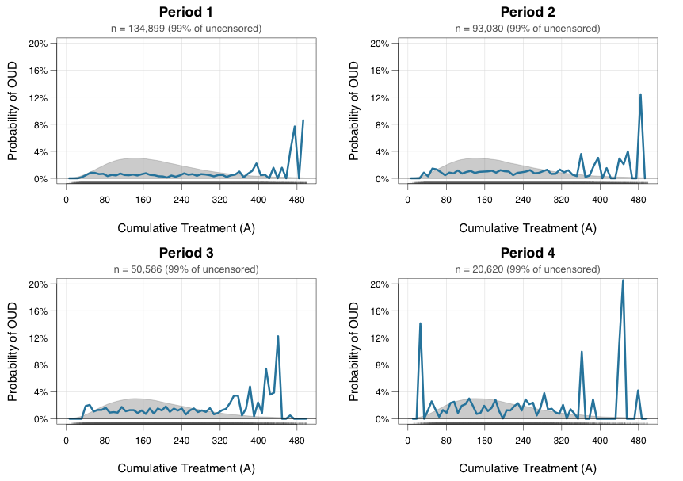

# Doubly-robust Exposure Response Curve for Binary Outcomes with Censoring Weights

Doubly-robust estimation of continuous treatment effects for binary outcomes with censoring, based on an extension of Kennedy et al. (2017).

## Overview

This code estimates causal exposure-response curves for continuous treatments when:
- The outcome is binary 
- Observations may be censored

The approach uses SuperLearner ensembles for flexible nuisance function estimation, doubly-robust pseudo-outcomes, and local polynomial regression with cross-validated bandwidth selection.

## Installation
```r
install.packages(c("SuperLearner", "earth", "gam", "ranger", "KernSmooth", "zoo"))
```

## Usage
```r
source("kennedy_erf_binary_censoring.R")
source("plotting.R")

results <- ctseff_binary(
  y = outcome,
  a = treatment,
  x = covariates,
  cens = censoring_indicator,  # 1 = observed, 0 = censored
  bw.seq = seq(0.1, 2, length.out = 50),
  use_censoring_weights = TRUE,
  sl.lib = c("SL.glm", "SL.earth", "SL.gam", "SL.ranger")
)

# Results: data frame with a.vals, est, se, ci.ll, ci.ul
head(results$res)
```

### Multi-period analysis
```r
all_results <- list()
for (period in 1:4) {
  all_results[[period]] <- ctseff_binary(
    y = df[[paste0("outcome_period_", period)]],
    a = df$A,
    x = as.matrix(df[, covariate_names]),
    cens = df[[paste0("cens_period_", period)]],
    bw.seq = seq(0.1, 2, length.out = 50)
  )
}

plot_dose_response_enhanced(all_results, df, xlim = c(0, 500), ylim = c(0, 0.2))
```



## Files

| File | Description |
|------|-------------|
| `kennedy_erf_binary_censoring.R` | Main estimator with integrated IPCW |
| `kennedy_erf_binary.R` | Core estimator (complete-case only) |
| `plotting.R` | Publication-quality visualization with density overlays |
| `analysis_sim_data.R` | Example analysis script |

## Key parameters

| Parameter | Description |
|-----------|-------------|
| `y` | Binary outcome (0/1) |
| `a` | Continuous treatment |
| `x` | Covariate matrix |
| `cens` | Censoring indicator (1 = observed) |
| `use_censoring_weights` | Apply inverse probability of censoring weighting |
| `stabilize_weights` | Use stabilized weights (recommended) |

## Reference

Kennedy EH, Ma Z, McHugh MD, Small DS (2017). Non-parametric methods for doubly robust estimation of continuous treatment effects. *Journal of the Royal Statistical Society: Series B*, 79(4), 1229-1245.
